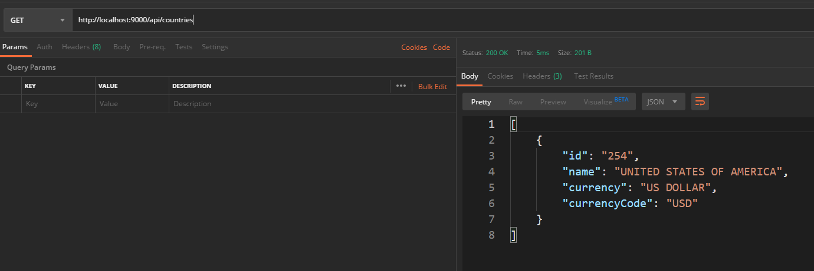

# REST API with Go & Mux

This is a simple API built on GoLang & Mux package.

## Build

Run the below script to build and run the API solution.

```bash
go build && ./GoLangRESTAPI
```

## Result




## Contributing
Pull requests are welcome.

## License
[MIT](https://choosealicense.com/licenses/mit/)
